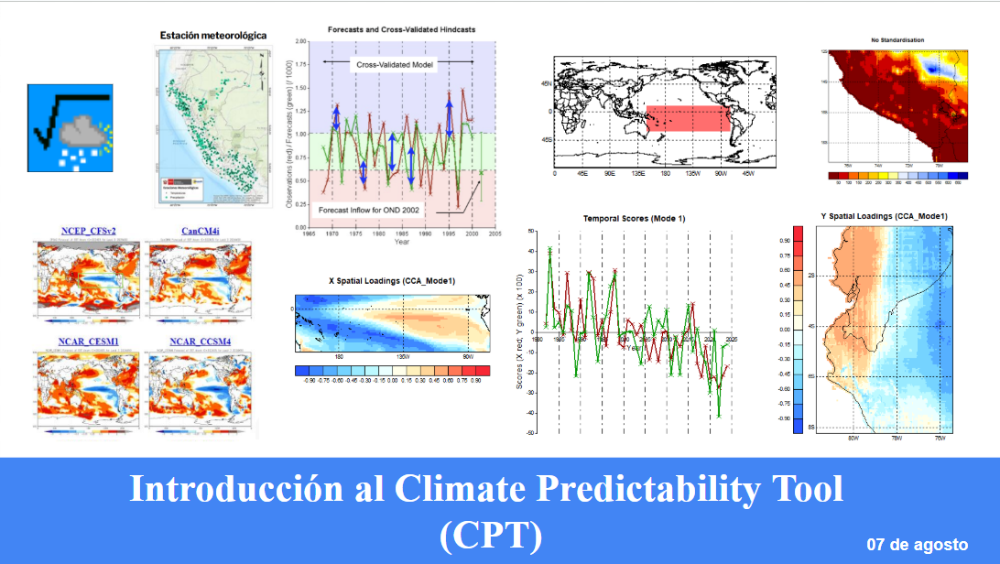

# Curso CPT UNALM 2025
# 📊 Curso CPT UNALM 2025

Este repositorio contiene el material del **Curso CPT UNALM 2025**, centrado en el uso del Climate Predictability Tool (CPT) para el desarrollo de pronósticos estadísticos en climatología.

---

## 🧠 BLOQUE 1: Introducción al CPT y conceptos base

**🎯 Objetivo:** Comprender el propósito del CPT y los fundamentos del pronóstico estadístico.

### 📚 Contenido:
- ¿Qué es el CPT y para qué se usa?
- Predictores vs. predictandos
- Métodos en CPT: CCA, PCR, regresión lineal
- Instalación del software y estructura de su interfaz
- Nociones básicas de validación (TCC, ROC, skill)

### 🧪 Práctica:
- Instalación del CPT
- Exploración de la interfaz y menús

---

## ⚙️ BLOQUE 2: Preparación, carga y ejecución de un pronóstico básico

**🎯 Objetivo:** Aprender a preparar datos, cargarlos y generar un pronóstico en CPT.

### 📚 Contenido:
- Descarga de predictores desde el IRI
- Estructura de archivos ASCII y CSV
- Preparación de datos
- Selección de predictandos y predictores
- Configuración de un análisis CCA
- Validación cruzada y salida de productos

### 🧪 Práctica:
- Carga de datos ASCII
- Corrida guiada de un pronóstico con datos default del CPT
- Análisis de resultados y mapas probabilísticos

---

## 🔄 BLOQUE 3: Manejo de formatos y conversión de datos externos

**🎯 Objetivo:** Entender y aplicar herramientas para transformar datos externos al formato requerido por CPT.

### 📚 Contenido:
- Tipos de formatos climáticos comunes: NetCDF, CSV, ASCII
- Herramientas de conversión: Python
- Extracción de series de tiempo desde datos grilla (gridded)
- Automatización de datos NetCDF → ASCII

### 🧪 Práctica:
- Conversión de un archivo NetCDF a ASCII
- Subconjunto de una región y exportación al formato CPT
- Preparación para uso en pronóstico posterior (bloque 4)

---

## 🌍 BLOQUE 4: Pronóstico con datos grillados de fuentes externas

**🎯 Objetivo:** Utilizar datos grilla (fuera del IRI/CPT) como predictandos.

### 📚 Contenido:
- Reanálisis y otros datasets grillados: PISCO
- Configuración del CPT con datos externos
- Validación y análisis de resultados

### 🧪 Práctica:
- Corrida completa usando un predictor grilla (convertido en el bloque 3)

---

## 📈 BLOQUE 5: Pronóstico con datos observados de estaciones  
**(CASO PRÁCTICO: INUNDACIONES)**

**🎯 Objetivo:** Aplicar el CPT con datos locales u operativos de estaciones meteorológicas.

### 📚 Contenido:
- Vistazo a fuentes de datos observados hidrométricos (Visor ANA)  
- Preparación de series observadas (formato)
- Automatización de datos observados (CSV → ASCII)

### 🧪 Práctica:
- Ejercicio con datos reales de estaciones
- Interpretación del producto final
- Recomendaciones para operativizar el pronóstico estadístico

---

### 📂 Estructura del repositorio

